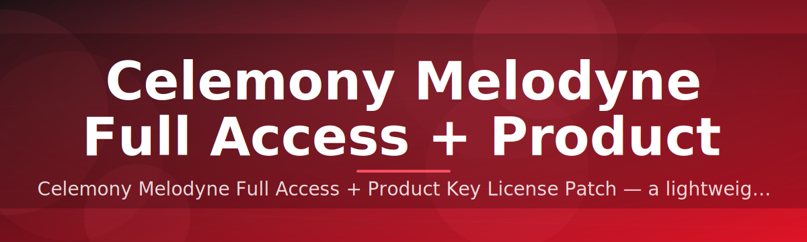

# 🎛️ Celemony Melodyne License Configurator ✅

### ⭐ Star this repo if it helped you!

  

---

## Table of Contents

- [What This Is NOT](#what-this-is-not)
- [About](#about)
- [Requirements](#requirements)
- [Features](#features)
- [Installation](#installation)
- [FAQ](#faq)
- [Community / Support](#community--support)
- [License](#license)
- [Disclaimer](#disclaimer)
- [Download](#download)

---

## What This Is NOT

This is **not** a keygen, crack, or piracy tool. It's **not** a Python script, browser extension, or cloud service. It's **not** affiliated with or endorsed by Celemony.

It **is** a standalone Windows `.exe` that streamlines local license configuration for Melodyne installs — one binary, no dependencies, no setup scripts.

---

## About

`celemony-melodyne-license-configurator` reads and applies license configuration data for Melodyne on Windows, handling the common activation-state edge cases that trip up manual setups.

> [!NOTE]
> Built for Windows 10/11 x64. No install wizard — download, run, done.

> [!TIP]
> Run the tool once per Melodyne installation. Re-run only after a Melodyne update or reinstall.

---

## Requirements

- Windows 10 or Windows 11 (64-bit)
- Melodyne installed on the target machine
- Admin rights (for writing config paths)
- ~50MB free disk space

> [!IMPORTANT]
> No Python, no pip, no build tools. This is a **compiled .exe** — double-click and go.

---

## Features

- Single-binary Windows executable — zero dependencies
- Auto-detects existing Melodyne installation path
- License/config validation before applying changes
- Backup of original config before any write
- Clean rollback option if something looks wrong
- Minimal UI — three clicks from launch to done
- Works across Melodyne 4/5 install trees
- No background services, no telemetry

---

## Installation

1. Download the `.exe` from the [Download](#download) button above.
2. Run it as Administrator (right-click → *Run as administrator*).
3. Point it at your Melodyne install folder if not auto-detected.
4. Click **Apply** — restart Melodyne when prompted.

---

## FAQ

**Does this work on macOS?**
No. Windows 10/11 only, x64 architecture.

**Do I need Melodyne already installed?**
Yes — this configures an existing install, it doesn't install Melodyne itself.

**Will an update to Melodyne break the config?**
Possibly. Re-run the tool after any Melodyne update.

> [!TIP]
> If Melodyne fails to detect the license after applying, restart the DAW fully — not just the plugin instance.

**Is my antivirus going to flag the .exe?**
Some heuristics flag unsigned binaries. Whitelist the folder if that happens.

---

## Community / Support

- Open an [Issue](../../issues) for bugs or install problems.
- Check existing issues before filing a duplicate.
- PRs welcome — keep changes scoped and documented.

---

## License

MIT License © 2026. See [LICENSE](LICENSE) for full text.

---

## Disclaimer

> [!CAUTION]
> Use at your own risk. This tool modifies local configuration files — always back up before running. The maintainers are not responsible for license or software issues resulting from misuse.

This project is provided as-is, with no warranty. It is not affiliated with, sponsored by, or endorsed by Celemony GmbH.

---

## Download

  

